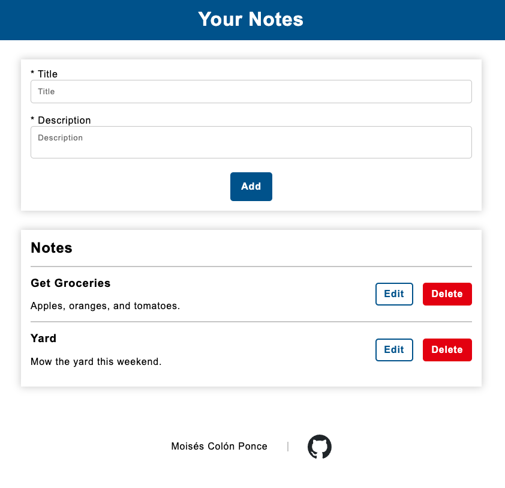

# React Demo - Notes v1 - Moises Colon Ponce

I am pleased to introduce a demonstration web application that showcases the fundamental CRUD (Create, Read, Update, Delete) operations using React. This demonstration highlights the utilization of React's core functionalities, including functional components, hooks, props, and its powerful reactivity system.

It is worth noting that this demonstration exclusively relies on React, JavaScript, HTML, and CSS to achieve its objectives. The only additional component utilized is TypeScript, enhancing the application's type safety and developer experience.

We invite you to explore this demonstration to gain insights into how React can efficiently handle CRUD operations and facilitate the development of interactive web applications.

Should you have any questions or require further information, please do not hesitate to contact me.

 

## Links

- [Demo](https://react-demo-notes-v1.web.app/)
- [Code](./src/)

 

## Screenshots

### At load time

### After adding notes

### When editing a note

 

## Lighthouse

### Desktop

### Mobile

